# AGENTS.md

## Table of Contents
1. [Project Overview](#project-overview)
2. [System Purpose & Use Case](#system-purpose--use-case)
3. [Architecture & System Design](#architecture--system-design)
4. [Project Structure](#project-structure)
5. [Hardware Requirements](#hardware-requirements)
6. [Pin Configuration](#pin-configuration)
7. [Dependencies](#dependencies)
8. [Implemented Features](#implemented-features)
9. [Recent Critical Fixes](#recent-critical-fixes)
10. [Planned Features](#planned-features)
11. [Development Environment](#development-environment)
12. [API Documentation](#api-documentation)
13. [Coding Style Guidelines](#coding-style-guidelines)
14. [Component/Feature Creation Rules](#componentfeature-creation-rules)
15. [Compilation and Testing Requirements](#compilation-and-testing-requirements)
16. [Testing & Quality Assurance](#testing--quality-assurance)
17. [Pull Request and Collaboration Guidelines](#pull-request-and-collaboration-guidelines)
18. [Troubleshooting](#troubleshooting)
19. [Restricted or Sensitive Files](#restricted-or-sensitive-files)
20. [Additional Notes](#additional-notes)

---

## Project Overview

**Coop Controller** is an ESP32-based intelligent automation system designed to manage and monitor a chicken coop environment. The system provides automated control of critical functions including:

- **Temperature Monitoring** - Dual sensor inputs supporting Dallas temperature sensors or water meters with automatic detection
- **Water System Management** - Automated pump control with freeze prevention and water flow monitoring
- **Door Automation** - Motorized door control with safety sensors (planned)
- **Lighting Control** - PWM-based automated lighting with smooth sine-wave transitions; fully implemented with web UI
- **Remote Monitoring** - Web-based UI with real-time status updates
- **Alert System** - Email/Telegram notifications for critical events (planned)
- **AI Integration** - Weather-based decision making for daily operations (planned)

The project uses Platform.io for firmware development and features a modern SolidJS web interface with Tailwind CSS styling. All settings are configurable through the web UI and persisted in LittleFS storage.

**Implementation Status:**
- Phase 3 (Hardware I/O): 100% complete
- Phase 3.5 (Critical Refactoring): WiFi Controller ✅, Logger Methods ✅, remaining items in progress
- Phase 3.5a (Sunrise/Sunset Integration): 100% complete with accurate UTC to local time conversion
- Phase 3.5b (Light Control with Web UI): 100% complete
- Core features: Sensors, Pump, Light, WiFi controllers fully implemented with complete web UI
- Current build: RAM 17.7% (58,248 bytes), Flash 82.0% (1,074,145 bytes)
- Ready to continue with pump enhancements and remaining Phase 3.5 features

**Key References:**
- ESP32 pin functions defined in [`platformio.ini`](platformio.ini:45)
- Pin layout reference: [`docs/esp32_devkitC_v4_pinlayout.png`](docs/esp32_devkitC_v4_pinlayout.png)
- Setup instructions in [`README.md`](README.md:1)

---

## System Purpose & Use Case

### Primary Purpose
This system automates chicken coop management to ensure optimal bird health, safety, and egg production while minimizing manual intervention.

### Key Functions

**1. Freeze Prevention (Active)**
- Monitors ambient temperature via sensors (Dallas temperature or water meter inputs)
- When temperature drops below threshold (default 34°F), pump activates in cycling mode
- Circulates warm water through watering system to prevent freezing
- Water meter verifies pump operation and detects frozen/blocked/empty lines
- Configurable cycling intervals (default: 5 min ON / 10 min OFF)

**2. Door Security (Planned)**
- Opens door early in the day based on conditions
- Closes after sunset to secure chickens from predators
- AI-powered daily door recommendations based on weather forecast that the user can choose to accept theough the web UI, Telegram or email
- Hall effect sensors ensure proper open/closed positioning
- Current monitoring for fault detection (motor stall/obstruction)
- Daily confirmation via Telegram/Email/Web UI/Home Assistant

**3. Lighting for Production (Active)**
- Extends daylight exposure during darker seasons
- PWM dimming with gradual sine-curve transitions
- Automatic scheduling based on configurable ON/OFF hours
- Manual override capabilities with timers
- Smooth fade-in/fade-out for bird comfort

**4. Monitoring & Alerts (Planned)**
- Real-time status via web UI
- Email/Telegram notifications for critical events (pump faults, sensor failures, API errors)
- Daily status reports with forecast and automated action plan
- Home Assistant integration for smart home interoperability

### Design Philosophy
The system aims for **mostly automated, AI-driven operation** with minimal daily human confirmation, primarily for the security-critical door operation. It leverages weather forecasts, temperature sensors, and historical data to make intelligent decisions while allowing manual overrides when needed.

---

## Architecture & System Design

### System Architecture

```mermaid
graph TB
    subgraph "Hardware Layer"
        ESP32[ESP32 DevKit C v4]
        TEMP1[Dallas Temp Sensor 1]
        TEMP2[Dallas Temp/Water Meter 2]
        PUMP[Water Pump Relay]
        DOOR[Door Motor DRV8833]
        LIGHT[Light PWM Output]
        HALL1[Hall Sensor Open]
        HALL2[Hall Sensor Closed]
        BUZZER[Buzzer Alert]
    end
    
    subgraph "Firmware Components"
        MAIN[main.cpp]
        TEMP_MGR[SensorManager]
        PUMP_CTRL[PumpController]
        DOOR_CTRL[DoorController]
        LIGHT_CTRL[LightController]
        SETTINGS[SettingsManager]
        LOGGER[Logger System]
        WEB[WebServer]
        WIFI[WiFi Manager]
    end
    
    subgraph "External Services"
        WEATHER[OpenWeather API]
        AI[OpenAI Compatible API]
        EMAIL[SMTP Email]
        TELEGRAM[Telegram Bot]
        SYSLOG[Syslog Server]
        HASS[Home Assistant MQTT]
    end
    
    subgraph "User Interfaces"
        WEBUI[SolidJS Web UI]
        MOBILE[Mobile Browser]
        HA[Home Assistant]
        BOT[Telegram Commands]
    end
    
    ESP32 --> TEMP1
    ESP32 --> TEMP2
    ESP32 --> PUMP
    ESP32 --> DOOR
    ESP32 --> LIGHT
    ESP32 --> HALL1
    ESP32 --> HALL2
    ESP32 --> BUZZER
    
    MAIN --> TEMP_MGR
    MAIN --> PUMP_CTRL
    MAIN --> DOOR_CTRL
    MAIN --> LIGHT_CTRL
    MAIN --> SETTINGS
    MAIN --> LOGGER
    MAIN --> WEB
    MAIN --> WIFI
    
    TEMP_MGR --> TEMP1
    TEMP_MGR --> TEMP2
    PUMP_CTRL --> PUMP
    DOOR_CTRL --> DOOR
    DOOR_CTRL --> HALL1
    DOOR_CTRL --> HALL2
    LIGHT_CTRL --> LIGHT
    
    WEB --> WEBUI
    WEB --> MOBILE
    WEBUI --> SETTINGS
    
    MAIN --> WEATHER
    MAIN --> AI
    MAIN --> EMAIL
    MAIN --> TELEGRAM
    LOGGER --> SYSLOG
    MAIN --> HASS
    
    BOT --> MAIN
    HA --> HASS
```



### Component Interactions

**Core Loop Flow:**
1. **WiFi Management** - Maintains connection, falls back to AP mode if needed
2. **Sensor Updates** - Reads temperature/water flow every 5 seconds
3. **Pump Control** - Updates pump state every 1 second based on temperature and flow
4. **Web Server** - Handles HTTP requests, serves UI, processes OTA updates
5. **Logging** - Maintains in-memory buffer, optional syslog forwarding

**Data Flow:**
- Sensors → SensorManager → PumpController → Physical Output
- User Input (Web UI) → WebServer → SettingsManager → LittleFS Storage
- Status Queries → WebServer → Components → JSON Response
- Alerts → Logger → Syslog/Email/Telegram (when implemented)

**State Management:**
- All user settings persisted to [`data/user_settings.json`](data/user_settings.json) in LittleFS
- Pump statistics tracked in-memory (reset on reboot or manual reset)
- WiFi credentials stored separately from system settings
- Log entries kept in circular buffer (max 150 entries)

---

## Project Structure

```
coop_controller/
├── lib
|   ├── BuzzerController 
│   |   ├── BuzzerController.cpp
│   |   ├── BuzzerController.h      # Buzzer control (planned)
│   |   ├── library.json
|   ├── DoorController 
│   |   ├── DoorController.cpp
│   |   ├── DoorController.h        # Door automation (planned)
│   |   ├── library.json
|   ├── LightController 
│   |   ├── LightController.cpp
│   |   ├── LightController.h       # Light control (implemented)
│   |   ├── library.json
|   ├── Logger 
│   |   ├── library.json
│   |   ├── Logger.cpp
│   |   ├── Logger.h                # Logging system
│   ├── PumpController 
│   |   ├── library.json
│   |   ├── PumpController.cpp
│   |   ├── PumpController.h        # Pump control logic
│   ├── SensorManager 
│   |   ├── library.json
│   |   ├── SensorManager.cpp
│   |   ├── SensorManager.h         # Temperature/water meter handling
|   ├── SettingsManager 
│   |   ├── library.json
│   |   ├── SettingsManager.cpp
│   |   ├── SettingsManager.h       # Configuration management
|   ├── SunriseSunset 
│   |   ├── library.json
│   |   ├── SunriseSunset.cpp
│   |   ├── SunriseSunset.h         # Sunrise/sunset calculations
|   ├── WebServer 
│   |   ├── library.json
│   |   ├── WebServer.cpp
│   |   ├── WebServer.h             # HTTP server and REST API
│   └── WifiController 
│       ├── library.json
│       └── WifiController.cpp      # WiFi implementation (new)
│       └── WifiController.h        # WiFi management (new)
│
├── src/                        # Implementation files
│   └── main.cpp                # Main entry point and loop
│
├── data/                       # Filesystem data (LittleFS)
│   ├── assets/                 # Web UI static assets (built)
│   ├── favicon.ico.gz          # Compressed favicon
│   ├── index.htm               # Web UI entry (built from web/)
│   └── user_settings.example.json  # Template settings file
│
├── web/                        # SolidJS web application
│   ├── src/
│   │   ├── About.tsx           # About page with library attributions
│   │   ├── App.tsx             # Main app component
│   │   ├── Logs.tsx            # Log viewer
│   │   ├── Settings.tsx        # Settings management UI
│   │   ├── Status.tsx          # Real-time status dashboard
│   │   └── Update.tsx          # OTA update interface
│   ├── scripts/
│   │   └── gzip-files.cjs      # Build script for asset compression
│   ├── devServer.js            # Mock API server for development
│   ├── package.json            # Node dependencies
│   └── vite.config.ts          # Vite build configuration
│
├── build_scripts/              # Build automation
│   ├── build_web.py            # Builds web UI and copies to data/
│   ├── post_build.py           # Post-build processing
│   └── merge_bin.py            # Binary merging for releases
│
├── test/                       # Unit tests for various test including library/module tests
│   ├── test_common 
│   |   ├── test_main.cpp
|   ├── test_embedded 
│   |   ├── test_main.cpp
|   └── test_desktop 
│       └── test_main.cpp
|
│
├── platformio.ini              # PlatformIO configuration
├── README.md                   # User documentation
├── Agents.md                   # This file - AI assistant context
└── docs/
    └── esp32_devkitC_v4_pinlayout.png  # Hardware reference
```

### File Organization Principles

- **Headers (include/)** - Class definitions and public interfaces
- **Source (src/)** - Implementation details
- **Data (data/)** - Runtime files deployed to ESP32 filesystem
- **Web (web/)** - Complete web application with dev server
- **Tests (test/)** - Unit tests using Google Test framework for desktop/native builds and UnitTest for embedded tests
- **Build Scripts** - Automation for building and deploying

---

## Hardware Requirements

### Microcontroller
- **Board:** ESP32 DevKit C v4
- **Chip:** ESP32-WROOM-32
- **Flash Memory:** 4MB recommended (for LittleFS storage)
- **RAM:** 520KB SRAM
- **Clock:** 240MHz dual-core
- **WiFi:** 802.11 b/g/n 2.4GHz
- **GPIO:** Multiple GPIO pins with PWM, ADC, I2C, SPI support

### Peripheral Modules

**Current Implementation:**
- **Dallas DS18B20 Temperature Sensors** (1-Wire protocol)
  - Operating range: -55°C to +125°C (-67°F to +257°F)
  - Resolution: 9-12 bit configurable
  - Pullup resistor required (4.7kΩ typical)

- **Water Flow Meter** (Pulse output)
  - Example: YF-S201 or similar
  - Configurable pulses-per-gallon ratio
  - 3-wire connection (VCC, GND, Signal)
  - Interrupt-driven pulse counting

- **MosFET** (for pump control)
  - N-Channel on ground
  - Current capacity suitable for pump

**Planned Implementation:**
- **DRV8833 Dual H-Bridge Motor Driver** (door control)
  - Two outputs for bidirectional motor control
  - No current sensing capability
  - Fault detection

- **Hall Effect Sensors** (door position sensing)
  - Digital output (HIGH/LOW)
  - Two sensors: fully open and fully closed positions

- **LED Lighting** (PWM controlled)
  - PWM-dimmable LED strips or bulbs
  - MOSFET driver if high current

- **Buzzer** (alert notifications)
  - Active or passive buzzer
  - 5V or 3.3V compatible

### Power Supply
- ESP32: 3.3V regulated (onboard regulator from 5V USB or VIN)
- Peripherals: 5V for relays, sensors (provide adequate current capacity)
- Motor: Voltage according to door motor specifications (via DRV8833)
- 12VDC for light
- **Note:** Power requirements vary based on connected peripherals

### Wiring Reference
See [`docs/esp32_devkitC_v4_pinlayout.png`](docs/esp32_devkitC_v4_pinlayout.png) for detailed pin layout and capabilities.

---

## Pin Configuration

All pins are defined in [`platformio.ini`](platformio.ini:45) as build flags and can be referenced in code using the defined constants. Inputs/outputs are active high unless marked outherwise, such as "_B" for active low.

### Currently Configured Pins

| Pin | Constant | Function | Type | Notes |
|-----|----------|----------|------|-------|
| 32 | TEMP_METER_PIN | Sensor 1 Input | Input+Pullup | Auto-detects Dallas temp or water meter |
| 33 | TEMP_METER_2_PIN | Sensor 2 Input | Input+Pullup | Auto-detects Dallas temp or water meter |
| 26 | OUT_PUMP_PIN | Pump Control | Output | Relay control for water pump |
| 25 | OUT_LIGHT_PIN | Light Control | PWM Output | LEDC channel 0, 5kHz, 8-bit resolution |

### Pins Defined for Future Implementation

| Pin | Constant | Function | Type | Status |
|-----|----------|----------|------|--------|
| TBD | WIFI_LED_B_PIN | WiFi Status LED | Output | Heartbeat when connected, active low, fast blink when disconnected |
| TBD | BUZZER_B_PIN | Alert Buzzer | Output | Sounds on fault conditions, active low |
| TBD | OUT_DOOR_A_OPEN_POS_PIN | Door Open Positive | Output | Drive motor to open door (polarity reversed to close) |
| TBD | OUT_DOOR_A_OPEN_NEG_PIN | Door Open Negative | Output | Drive motor negative to open door (polarity reversed to close) |
| TBD | DOOR_A_FAULT_B_PIN | Door Fault Input | Input | Active LOW on fault detected by DRV8833 driver board |
| TBD | DOOR_MANUAL_SWITCH_B_PIN | Door Manual Control Input | Input | Momentary switch to toggle door open/close |
| TBD | DOOR_A_HALL_SENSOR_OPEN_B_PIN | Door Fully Open Sensor | Input | Hall effect sensor, active low - door fully open |
| TBD | DOOR_A_HALL_SENSOR_CLOSED_B_PIN | Door Fully Closed Sensor | Input | Hall effect sensor, active low - door fully closed |

### Development Notes

- **Ambiguities:** Any ambiguities or questions should be clarified before coding
- **Web UI Settings:** Should be stored in [`data/user_settings.json`](data/user_settings.json), NOT hardcoded in firmware
- **Build Process:** PlatformIO commands build the C++ firmware (pio run) and npm builds the web UI (cd web && npm run build)
- **C++ Standard:** Code uses C++11 (`-std=gnu++11` in platformio.ini)
- **Compatibility:** Ensure C++ code is ESP32-compatible while using modern features where appropriate

### PlatformIO Configuration Changes

**MANDATORY APPROVAL REQUIREMENT:** Any modifications to `platformio.ini` (build flags, pins, libraries, etc.) must be proposed first with detailed justification and require explicit user approval before implementation. This prevents unintended hardware conflicts or configuration changes.

**Required Approval Process:**
1. **Documentation Update First:** Propose changes in documentation updates before any code implementation
2. **Detailed Justification:** Clearly explain the purpose, hardware implications, and necessity of each change
3. **Conflict Analysis:** Verify no conflicts with existing pin assignments or ESP32 reserved pins
4. **User Confirmation:** Use ask_followup_question to get explicit approval before implementing platformio.ini changes

**Examples Requiring Approval:**
- Pin definitions: `-DBUZZER_B_PIN=27` or `-DOUT_DOOR_A_OPEN_POS_PIN=14`
- Library additions or version changes
- Build flag modifications affecting compilation
- Upload protocol or port configuration changes

**Temporary Implementation Guidelines:**
- For development: All pins should be defined in platformio.ini using `-D` flags
- For production: Propose platformio.ini build flags after approval
- Request approval via orchestrator before finalizing any platformio.ini modifications

**Hardware Pin Approval Guidelines:**
1. **Pin Availability:** Ensure available, non-conflicting pins chosen (check reserved pins table)
2. **Hardware Compatibility:** Validates with specified sensor or device
3. **Interrupt Needs:** Supports interrupt-driven configurations if used
4. **Development Testing:** Tested in development with platformio.ini changes only after approval with conflicting values commented out if the change is temporary
5. **Documentation Update:** Added to this file before platformio.ini change

### Hardware Pin Approval Guidelines

Before adding new hardware pins, developers must:

1. **Pin Availability Verification:** Check against existing pin assignments and ESP32 reserved pins
2. **Documentation Update:** Add proposed pins to "Pins Defined for Future Implementation" table in this file first
3. **User Approval Request:** Use ask_followup_question to get explicit approval for platformio.ini changes
4. **Conflict Prevention:** Avoid boot pins (GPIO 0, 2, 15) and SPI flash pins (GPIO 6-11)
5. **Development Guidelines:** For temporary development, pins changes should be defined in platformio.ini with conflicts commented out with approval, but production implementation requires platformio.ini approval

---

## Dependencies

All dependencies are managed through PlatformIO and defined in [`platformio.ini`](platformio.ini:19).

### Core Libraries

| Library | Version | Purpose | Repository |
|---------|---------|---------|------------|
| `arduino` | framework | Arduino framework for ESP32 | Built-in |
| `espressif32` | platform | ESP32 platform support | Built-in |

### Communication & Networking

| Library | Version | Purpose |
|---------|---------|---------|
| `WiFi` | Built-in | WiFi connectivity |
| `ESPmDNS` | Built-in | mDNS for local network discovery |
| `esp32async/AsyncTCP` | 3.4.7 | Asynchronous TCP library |
| `esp32async/ESPAsyncWebServer` | 3.8.0 | Async HTTP web server |
| `SimpleSyslog` | 0.1.3 | Syslog client for remote logging |
| `mobizt/ReadyMail` | 0.3.6 | SMTP email client |
| `cotestatnt/AsyncTelegram` | 1.1.3 | Telegram bot integration |

### Data & Storage

| Library | Version | Purpose |
|---------|---------|---------|
| `LittleFS` | Built-in | Filesystem for ESP32 |
| `bblanchon/ArduinoJson` | 7.4.2 | JSON serialization/deserialization |
| `SettingsManager` | Local | Persistent configuration management |

### Sensors & I/O

| Library | Version | Purpose |
|---------|---------|---------|
| `milesburton/DallasTemperature` | 4.0.4 | Dallas DS18B20 temperature sensors |
| `OneWire` | Dependency | 1-Wire protocol implementation |

### OTA & Updates

| Library | Version | Purpose |
|---------|---------|---------|
| `ArduinoOTA` | Built-in | Arduino OTA updates |
| `ayushsharma82/ElegantOTA` | 3.1.7 | Web-based OTA with UI |

### Utilities

| Library | Version | Purpose |
|---------|---------|---------|
| `robtillaart/UUID` | 0.2.0 | UUID generation for log entries |
| `jpb10/SolarCalculator` | 2.0.2 | Sunrise/sunset calculations |
| `dawidchyrzynski/home-assistant-integration` | 2.1.0 | Home Assistant MQTT integration |

### Web UI Dependencies

Managed via npm in [`web/package.json`](web/package.json:1):

**Runtime:**
- `solid-js` 1.9.5 - Reactive UI framework
- `@solidjs/router` 0.15.3 - Client-side routing
- `tailwindcss` 4.1.10 - Utility-first CSS framework
- `@tailwindcss/vite` 4.1.10 - Vite integration for Tailwind
- `radix-ui` 1.4.2 - Unstyled UI components

**Development:**
- `vite` 6.2.0 - Build tool and dev server
- `vite-plugin-solid` 2.11.2 - SolidJS plugin for Vite
- `typescript` 5.7.2 - Type safety
- `daisyui` 5.0.43 - Component library for Tailwind
- `express` 5.1.0 - Mock API server for development
- `nodemon` 2.0.22 - Auto-restart dev server
- `shx` 0.4.0 - Cross-platform shell commands

---

## Implemented Features

### Core Components

#### SensorManager ([`SensorManager.h`](include/SensorManager.h:1) / [`SensorManager.cpp`](src/SensorManager.cpp))
- **Dual-purpose sensor inputs** - Automatically detects and configures Dallas DS18B20 temperature sensors or water meter pulse inputs on startup. Each pin is independently tested for Dallas sensor first; if none found, it's configured as a water meter input.
- **Temperature readings** - Fahrenheit conversion from Celsius with configurable thresholds,TODO: add setting to display in web UI either C or F
- **Water flow monitoring** - Interrupt-driven pulse counting with atomic operations for thread safety
- **Flow rate calculation** - Gallons per minute based on pulse frequency (60-second calculation interval, TODO: make configurable from UI)
- **Configurable calibration** - Pulses-to-gallons conversion factor (TODO: make configurable from UI)
- **Real-time status** - Connection state, sensor type, readings, pulse counts

#### PumpController ([`PumpController.h`](include/PumpController.h:1) / [`PumpController.cpp`](src/PumpController.cpp))
- **Temperature-based automation** - Activates pump when temperature drops below ON threshold (default 34°F)
- **Hysteresis control** - Separate ON/OFF thresholds prevent rapid cycling (default 34°F/36°F)
- **Cycling mode** - Configurable ON/OFF intervals when below threshold (default 5min/10min)
- **Manual control modes** - Force ON, force OFF, or AUTO mode
- **Flow error detection** - Monitors water flow when pump runs; detects frozen/blocked/empty lines
- **Automatic error handling** - Stops pump on flow error, retries on next cycle
- **Statistics tracking** - Total ON/OFF time, cycle counts, current cycle duration
- **State persistence** - Maintains state across updates

#### SettingsManager ([`SettingsManager.h`](include/SettingsManager.h:1) / [`SettingsManager.cpp`](src/SettingsManager.cpp))
- **Persistent storage** - JSON-based configuration in LittleFS
- **Singleton pattern** - Single global instance accessible via macro
- **WiFi credentials** - SSID, password, AP mode settings
- **System parameters** - Temperature thresholds, pump timings, flow error timeout
- **Auto mode flags** - Enable/disable automatic pump and light control
- **Debug settings** - Toggle debug logging
- **WiFi recovery** - Retry parameters, AP fallback duration
- **Immediate save** - Settings persisted on change
- **Example template** - [`user_settings.example.json`](data/user_settings.example.json) for reference

#### WebServer ([`WebServer.h`](include/WebServer.h:1) / [`WebServer.cpp`](src/WebServer.cpp))
- **Async HTTP server** - Non-blocking request handling using ESPAsyncWebServer
- **REST API** - JSON endpoints for status, settings, and control
- **Static file serving** - Serves SolidJS web UI from LittleFS
- **OTA support** - Both ArduinoOTA (network) and ElegantOTA (web-based)
- **OTA authentication** - Optional password protection for updates
- **mDNS** - Local discovery at `coopcontroller.local`
- **CORS enabled** - Supports cross-origin requests for development

#### Logger System ([`Logger.h`](include/Logger.h:1) / [`Logger.cpp`](src/Logger.cpp))
- **In-memory buffer** - Circular buffer for last 150 log entries
- **UUID tracking** - Unique identifier for each log entry
- **Timestamp support** - NTP-synchronized timestamps when available
- **Level-specific methods** - logInfo(), logWarning(), logError(), logDebug(), logVerbose() for clear severity indication
- **Automatic filtering** - Debug and verbose messages filtered based on settings
- **JSON export** - REST endpoint for web UI consumption
- **Syslog integration** - Optional remote logging to syslog server
- **Serial output** - Simultaneous logging to Serial monitor

#### LightController ([`LightController.h`](include/LightController.h:1) / [`LightController.cpp`](src/LightController.cpp))
- **PWM dimming control** - ESP32 LEDC (LED Control) peripheral with 8-bit resolution
- **Sine curve transitions** - Smooth fade-in/fade-out following natural lighting curves for auto mode
- **Immediate manual response** - Manual controls work instantly without unwanted fade transitions
- **Configurable timing** - Separate ON/OFF hours with transition duration settings
- **Manual control modes** - Force ON, force OFF, or AUTO mode
- **Timer functionality** - Manual ON with configurable duration (15min, 30min, 1hr, 2hr, 4hr)
- **State machine** - Handles OFF, FADING_IN, ON, FADING_OUT, MANUAL states
- **Settings integration** - Auto mode flag, brightness levels, ON/OFF hours, fade duration
- **REST API** - Manual control endpoints and status reporting
- **Web UI complete** - Full implementation in Status.tsx (controls) and Settings.tsx (configuration)

#### SunriseSunset ([`SunriseSunset.h`](include/SunriseSunset.h:1) / [`SunriseSunset.cpp`](src/SunriseSunset.cpp))
- **Accurate calculations** - Uses SolarCalculator library for precise sunrise/sunset times
- **UTC to local time** - Automatic conversion from UTC to configured timezone offset
- **Location-based** - Configurable latitude/longitude in settings
- **Timezone support** - User-configurable UTC offset (e.g., -7 for Mountain Time)
- **Automatic updates** - Recalculates when location or timezone settings change
- **Web UI display** - Shows current sunrise/sunset times in Status and Settings pages
- **Ready for automation** - Foundation for door scheduling and light timing enhancements

### Sensor Management
- Automatic sensor type detection on startup (Dallas temperature vs water meter) - Each pin independently tested for Dallas sensor first; if none found, configured as water meter
- Temperature readings in Fahrenheit with user-configurable thresholds
- Water flow rate calculation in GPM and pulse counting
- Real-time sensor status monitoring and error detection
- Independent operation of two sensors (different types allowed)

### Pump Control Logic
- Temperature-based automatic cycling mode with hysteresis (separate ON/OFF thresholds)
- Manual ON/OFF/AUTO control modes via web UI or REST API
- Flow error detection with automatic pump shutdown when no flow detected
- Configurable flow error timeout (default 120 seconds)
- Automatic retry after configurable delay (default 120 seconds)
- Comprehensive statistics tracking (total on/off time, cycle counts, current state)
- Configurable cycling intervals (on/off times in seconds)
- State machine implementation for reliable state transitions

### Web Interface
- **Real-time status dashboard** - Sensor readings, pump state, light status, sunrise/sunset times, system info
- **Auto-refresh** - Status updates every 2.5 seconds
- **Manual pump controls** - ON/OFF/AUTO buttons with immediate feedback
- **Light controls** - ON/OFF/AUTO buttons, timer selection, brightness display
- **Sunrise/Sunset display** - Shows calculated times based on location and timezone
- **Settings management** - All system parameters configurable including light settings
- **WiFi configuration** - SSID/password entry with AP mode fallback
- **System logs** - Scrollable log viewer with timestamps
- **OTA updates** - Firmware and filesystem update interface
- **Responsive design** - Tailwind CSS with DaisyUI components
- **Dark mode support** - Modern, professional UI

#### WifiController ([`WifiController.h`](include/WifiController.h:1) / [`WifiController.cpp`](src/WifiController.cpp))
- **Automatic connection** - Connects to saved SSID on boot
- **Retry logic** - Configurable retry count and delay
- **AP mode fallback** - Creates `CoopController` WiFi network when connection fails
- **Connection persistence** - Tracks successful connections to avoid unneeded AP mode
- **Automatic reconnection** - Monitors connection and retries if dropped
- **mDNS support** - Accessible at `coopcontroller.local` on local network
- **Configurable timeouts** - AP mode duration, retry intervals
- **Clean separation** - Extracted from main.cpp for better code organization
- **Encapsulated state** - All WiFi-related globals moved into controller class

---

## Planned Features

Features organized by priority and implementation status.

### Critical Priority - Core Functionality

#### Water Meter Calibration
- Make pulse-to-gallons conversion factor configurable from web UI
- Currently hardcoded in SensorManager constructor
- Allow users to calibrate based on their specific water meter model
- Store calibration factor in settings

#### Sensor Error Handling
- Display "---°F" or "Unknown" when Dallas sensor not detected
- Currently shows 0°F which is misleading
- Show descriptive error message in web UI
- Add retry logic for sensor detection
- Fall back to weather API current temp if available and show it as the source in UI

#### Pump Flow Per-Pulse Calculation
- Calculate flow rate after every pulse instead of fixed interval
- Provides instantaneous flow measurement based on time between pulses
- More responsive to flow changes
- Better detection of flow variations
- Configurable option to switch between interval-based and per-pulse calculation

#### Pump Flow Monitoring Enhancement
- Monitor for water flow when pump is OFF
- Detect if pump fails to stop (stuck relay, valve leak)
- Log warning and alert user if flow detected when pump should be off
- Add configurable grace period after pump turns off
- Help identify hardware faults and water leaks

#### Minimum Daily Pump Cycles Enforcement
- Run pump X times per day regardless of temperature to keep pipe full and prevent water stagnation
- Prevents algae growth and maintains water freshness
- Keeps pump seals lubricated for longevity
- Configurable minimum cycles (default: 2-3 per day)
- Configurable minimum run duration per cycle
- Schedule evenly throughout day when not triggered by temperature

#### Factory Reset Functionality
- Hard reset button or procedure to clear all settings
- Revert to default/empty values
- Clear WiFi credentials and enter AP mode
- Essential for troubleshooting and device transfer

### High Priority - Safety & Reliability

#### WiFi Status LED
- Implement heartbeat LED on WIFI_LED_B_PIN when connected
- Fast blink pattern when disconnected
- Visual status indicator without requiring web UI access

#### Buzzer Alerts
- Sound buzzer on fault conditions (pump failure, sensor error)
- Configurable alert patterns for different issues
- Web UI silencing button
- Persistent until acknowledged or resolved

#### ESP32 Watchdog
- Implement watchdog timer for main loop
- Automatic restart if loop hangs
- Prevents system lockup
- Log watchdog resets for debugging


#### Automatic Door Close After Sunset
- Add setting `door_auto_close_after_sunset_enabled` (boolean, default false)
- Add setting `door_auto_close_after_sunset_minutes` (integer, default 0)
- Automatically close door X minutes after calculated sunset time when enabled
- **Dependencies:** Requires Sunrise/Sunset Integration (above) to be completed first
- **Implementation Notes:**
  - Separate from existing `sunset_offset_minutes` setting (which affects both open and close times)
  - This specifically adds a delay AFTER sunset for closing only
  - Respects door auto mode settings
  - Example: If sunset is 6:30 PM and setting is 30 minutes, door closes at 7:00 PM
  - Logs scheduled close time and actual execution
  - User can disable entirely or set to 0 for immediate close at sunset
  - Web UI displays calculated close time based on current sunset + offset

#### Door Timeout Auto-Calculation
- Track historical door open/close times
- Calculate timeout automatically: max(historical_time) + 1 second buffer
- Store last N operations for averaging
- Fallback to user-configured value if no history
- Display calculated timeout in web UI
- Allow manual override of auto-calculated value

#### Door Progress Calculation
- Calculate open/close progress percentage during operation
- Based on elapsed time vs expected timeout duration
- Display progress bar in web UI during door movement
- Helps identify slow operations or obstructions
- Update progress in real-time via status endpoint

#### Improved Connection Status
- Only show "connected" if water meter pulse detected
- More accurate connection state reporting
- Helps identify sensor vs network issues

### High Priority - Monitoring & Notifications

#### Email Notifications
- SMTP server/port,tls and credentials configuration in web UI settings
- "From" email address configuration
- Notify on pump/water flow faults
- Notify on temperature sensor failures
- Notify on API failures (OpenWeather, OpenAI)
- Daily status and forecast reports
- Configurable notification times

#### Telegram Integration
- Bot commands for basic controls (pump on/off, door open/close, get status)
- Status queries (door position, light state, temperature)
- Alert notifications for critical events
- Daily forecast and automation plan
- Approval/confirmation commands for AI door recommendations

#### External Pushbutton for Manual Pump Cycle
- Add support for external momentary pushbutton
- Single press triggers one complete pump cycle (ON time + OFF time)
- Useful for testing or manual water circulation
- Pin configuration in platformio.ini (requires approval)
- Debouncing and interrupt-driven detection
- Visual/audio feedback when activated

#### System Status Display
- Show heap memory, CPU usage in web UI
- Display uptime since last reboot
- Log periodic status if verbose logging enabled
- Help identify memory leaks or performance issues

### Medium Priority - Door Automation

#### Door Control
- Bidirectional motor control using DRV8833 (OUT_DOOR_A_OPEN_POS_PIN / OUT_DOOR_A_OPEN_NEG_PIN)
- Hall effect position sensors (DOOR_A_HALL_SENSOR_OPEN_B_PIN / DOOR_A_HALL_SENSOR_CLOSED_B_PIN)
- Fault detection with input from DRV8833 board and internal timeout (DOOR_A_FAULT_B_PIN active LOW)
- Manual control from external switch, hit switch to open/close door
- Configurable timeout values
- Manual control from web UI
- Automatic control based on:
  - Sunrise/sunset with configurable offsets
  - Weather conditions via OpenWeather API
  - AI recommendations via OpenAI-compatible API
  - User approval/override required daily

#### AI-Powered Door Decisions
- Daily AI recommendation based on:
  - Past weather (snow likely on ground?)
  - Daily forecast (precipitation, temperature)
  - Historical patterns (external configurable database to hold full event and weather history?)
- Confirmation options via:
  - Telegram bot command
  - Email response via link calling webserver
  - Web UI button
  - Home Assistant integration
- Safety override: manual control always available

### Medium Priority - UI Improvements


#### Event-Driven Web UI Updates
- Replace polling-based status updates with Server-Sent Events (SSE) or WebSockets
- Push updates only when state changes occur
- Reduces network traffic and improves responsiveness
- Maintain fallback to polling for compatibility
- Implement on ESP32 using AsyncWebServer capabilities

#### Web UI Routing Fix
- Fix error when refreshing page on non-root routes
- Configure proper fallback routing in Vite and web server
- Serve index.html for all unknown routes (SPA behavior)
- Test all routes work correctly after refresh
- Ensure proper 404 handling for actual missing resources

#### Web UI Theming Based on Logo
- Design color scheme based on provided logo.webp
- Update Tailwind/DaisyUI theme configuration
- Create cohesive visual identity
- Consider dark/light mode variations
- Apply consistently across all pages

#### Mobile UI Optimization
- Fix horizontal scrolling issues on mobile devices
- Prevent content cutoff on smaller screens
- Optimize touch targets for mobile interaction
- Test on various mobile screen sizes
- Improve responsive breakpoints in Tailwind config

#### Historical Data Visualization
- Add graphs showing past 24 hours of data
- Temperature trends from both sensors
- Water meter flow rates and totals
- Pump on/off states and cycle history
- Light brightness levels over time
- Use lightweight charting library (Chart.js or similar)

### Medium Priority - API Integrations

#### OpenWeather API
- API key configuration in web UI settings
- Location configuration (coordinates queries from browswr in web UI or zip code setting)
- Daily weather forecast retrieval
- Historical weather data for AI decision making
- Integration with door and pump automation

#### OpenAI-Compatible API
- Base URL and API key configuration in web UI
- Compatible with OpenAI, Anthropic Claude, or local models
- Decision engine for door recommendations
- Analysis of weather patterns amd event history
- Customizable prompts from web UI

#### GPS/Location Services
- Enter zip code OR latitude/longitude in web UI
- Request geolocation from browser
- Used for sunrise/sunset calculations
- Used for OpenWeather API queries
- Store in settings for persistent use

#### Home Assistant Integration
- MQTT settings configuration in web UI (broker, port, credentials)
- Expose entities: sensors, switches, lights
- Real-time status updates
- Remote control capabilities
- Automation integration
- Alert notifications via HA
- Auto discovery in Hime Assistant

### Low Priority - Documentation & Clarifications

#### Door Test Mode Documentation
- Document what door test mode is and its purpose (it doesn't seem to do anytthing currently?)
- Explain when and why to use test mode
- Detail test mode behaviors and safety features
- Add to user documentation and web UI help text
- Include in API documentation

### Low Priority - Enhancements

#### Configurable Intervals
- Make FLOW_CALCULATION_INTERVAL configurable from web UI
- Currently hardcoded at 60000ms (1 minute)
- Allow users to adjust based on flow rates

#### Remote Syslog Configuration
- Move syslog server/port from compile-time defines to web UI settings
- Runtime configuration changes
- Multiple syslog targets

#### Mobile Optimization
- Optimize web UI for mobile devices
- Touch-friendly controls
- Responsive layout improvements
- PWA capabilities for app-like experience

#### Component Refactoring
- Change enums to enum class for type safety
- Update web server JSON handling to use string states for enum classes instead of numeric values for enums

#### Enhanced Testing
- Add unit tests for key components using Google Test framework for desktop/native testing and UnitTest for embedded testing
- Increase code coverage
- Automated testing in CI/CD pipeline
- Integration tests for API endpoints

#### Documentation
- Add more detailed inline documentation for complex functions
- Improve code comments
- Update diagrams and architecture docs
- Add troubleshooting guides
- Add full method and class Doxygen headers

#### Reboot Controls
- Add reboot button to web UI
- Option to schedule reboots
- Clear indication before reboot executes

#### Network Safety
- Ensure no web-related calls when not connected to WiFi
- Prevent OpenWeather/OpenAI/email/Telegram calls without connection
- Queue requests for when connection restored
- Graceful degradation in offline mode

---

## Development Environment

### Setup Instructions

1. **Install Platform.io**
   - Option A: Install Platform.io IDE (standalone)
   - Option B: Install VSCode + Platform.io extension (recommended)

2. **Clone Repository**
   ```bash
   git clone <repository-url>
   cd coop_controller
   ```

3. **Install Dependencies**
   - Platform.io will automatically download required libraries on first build
   - For web development: `cd web && npm install`

4. **Configure Build Environment**
   - Set variables for firmware version in platformio.ini
   - Optional: Set OTA and AP passwords in environment or platformio.ini

5. **MCP Tools Setup** (for AI-assisted development)
   - Use Context7 for latest library documentation references
   - Use Playwright for web UI testing
   - Use appropriate MCP tools as needed (Brave Search for web lookups, etc.)

### Key Commands

**Firmware Build & Upload:**
```bash
pio run                    # Build firmware
pio run --target upload    # Upload to device
pio device monitor         # Serial monitor
pio run -t clean          # Clean build files
```

**Web Development:**
```bash
cd web
npm install               # Install dependencies (first time)
npm run dev              # Start dev server with mock API
npm run build            # Build and copy to /data for ESP32
```

**Upload Filesystem:**
- Use Platform.io: "Upload Filesystem Image" command
- Or: `pio run --target uploadfs`

**Testing:**
```bash
pio test                   # Run unit tests
cd web && npm test        # Run web UI tests (when implemented)
```

### Upload Port Configuration

Set in [`platformio.ini`](platformio.ini:76):
```ini
upload_port = COM22        # Windows
; upload_port = /dev/ttyUSB0   # Linux
; upload_port = /dev/cu.usbserial-*  # macOS
```

Or use OTA:
```ini
upload_protocol = espota
upload_port = coopcontroller.local
upload_flags = --auth=<password>
```

### Important References

**Platform.io:**
- Documentation: https://docs.platformio.org
- Library Registry: https://registry.platformio.org

**ESP32:**
- Official Documentation: https://docs.espressif.com/projects/esp-idf/en/latest/esp32/
- Pin reference: [`docs/esp32_devkitC_v4_pinlayout.png`](docs/esp32_devkitC_v4_pinlayout.png)

**SolidJS:**
- Documentation: https://www.solidjs.com/docs/latest
- Tutorial: https://www.solidjs.com/tutorial

**Additional Resources:**
- `.url` files in project root link to important resources
- ESP32 pinout images for hardware reference
- Library documentation via Context7 MCP tool

### Development Notes

- **Ambiguities:** Any ambiguities or questions should be clarified before coding
- **Web UI Settings:** Should be stored in [`data/user_settings.json`](data/user_settings.json), NOT hardcoded in firmware
- **Build Process:** Web UI automatically builds and compresses assets via [`build_web.py`](build_scripts/build_web.py)
- **C++ Standard:** Code uses C++11 (`-std=gnu++11` in platformio.ini)
- **Compatibility:** Ensure C++ code is ESP32-compatible while using modern features where appropriate

### PlatformIO Configuration Changes

**MANDATORY APPROVAL REQUIREMENT:** Any modifications to `platformio.ini` (build flags, pins, libraries, etc.) must be proposed first with detailed justification and require explicit user approval before implementation.

### Factory Reset Procedure

**To perform a factory reset:**

1. **Via Web UI** (when implemented):
   - Navigate to Settings
   - Click "Factory Reset" button
   - Confirm action
   - Device will restart in AP mode with default settings

2. **Via Serial Console:**
   - Connect to device via serial monitor
   - Send command (when implemented): `FACTORY_RESET`
   - Confirm action
   - Device will restart

3. **Manual Filesystem Erase:**
   ```bash
   pio run --target erase
   pio run --target uploadfs
   ```

**Reset Behavior:**
- Clears all settings in [`user_settings.json`](data/user_settings.json)
- Removes WiFi credentials
- Sets AP mode active
- Reverts to default values for all configurable parameters
- Preserves firmware and web UI files
- Creates new AP network `CoopController`

---

## API Documentation

REST API endpoints provided by WebServer. All endpoints return JSON unless otherwise specified.

### Settings Management

#### GET `/get_settings`
Get current system settings (excludes password for security).

**Response:**
```json
{
  "ssid": "MyNetwork",
  "ap_mode": false,
  "enabled": true,
  "has_connected": true,
  "temp_threshold_on_f": 34.0,
  "temp_threshold_off_f": 36.0,
  "pump_on_time_seconds": 300,
  "pump_off_time_seconds": 600,
  "pump_auto_mode": true,
  "light_auto_mode": false,
  "light_on_hour": 6,
  "light_off_hour": 21,
  "debug_enabled": false,
  "water_flow_error_timeout_seconds": 120,
  "wifi_max_retries": 5,
  "wifi_retry_delay_seconds": 30,
  "wifi_ap_duration_minutes": 10
}
```

#### POST `/update_settings`
Update system settings. Only provided fields are updated.

**Request Body:**
```json
{
  "ssid": "NewNetwork",
  "passwd": "NewPassword",
  "temp_threshold_on_f": 32.0,
  "pump_auto_mode": true,
  "debug_enabled": true
}
```

**Response:** `200 OK` with "ok" text

**Note:** WiFi settings (ssid, passwd, ap_mode) trigger system restart after save.

### Status & Monitoring

#### GET `/sensor_status`
Get real-time sensor and pump status.

**Response:**
```json
{
  "sensor1": {
    "type": "DALLAS_TEMP",
    "connected": true,
    "temperature_f": 35.2,
    "flow_rate": 0.0,
    "pulse_count": 0,
    "status": "Connected"
  },
  "sensor2": {
    "type": "WATER_METER",
    "connected": true,
    "temperature_f": 0.0,
    "flow_rate": 2.5,
    "pulse_count": 1234,
    "status": "Connected - Active Flow"
  },
  "pump": {
    "state": "AUTO_ON",
    "is_active": true,
    "temperature_f": 35.2,
    "temperature_below_threshold": true,
    "flow_error": false,
    "current_cycle_time": 120,
    "time_until_next_switch": 180,
    "total_on_time": 3600,
    "total_off_time": 7200,
    "total_cycles": 10,
    "time_until_retry": 0
  },
  "system": {
    "temp_threshold_on_f": 34.0,
    "temp_threshold_off_f": 36.0,
    "pump_on_time_seconds": 300,
    "pump_off_time_seconds": 600,
    "pump_auto_mode": true,
    "light_auto_mode": false,
    "light_on_hour": 6,
    "light_off_hour": 21,
    "debug_enabled": false,
    "water_flow_error_timeout_seconds": 120
  }
}
```

#### GET `/logs`
Get system log entries.

**Response:**
```json
{
  "logs": [
    {
      "uuid": "a1b2c3d4-e5f6-7890-abcd-ef1234567890",
      "timestamp": 1698765432,
      "message": "System initialization complete"
    },
    {
      "uuid": "b2c3d4e5-f6a7-8901-bcde-f12345678901",
      "timestamp": 1698765492,
      "message": "Pump turned on - temperature below threshold"
    }
  ]
}
```

#### GET `/version`
Get firmware version and build information.

**Response:**
```json
{
  "firmware_version": "1.0.0",
  "chip_family": "ESP32-WROOM",
  "build_date": "Nov  1 2025",
  "build_time": "12:34:56"
}
```

### Pump Control

#### GET `/pump/on`
Force pump ON (override auto mode).

**Response:** `200 OK` with "Pump turned on" text

#### GET `/pump/off`
Force pump OFF (override auto mode).

**Response:** `200 OK` with "Pump turned off" text

#### GET `/pump/auto`
Enable automatic pump control based on temperature.

**Response:** `200 OK` with "Pump set to auto mode" text

#### GET `/pump/force_cycle`
Force an immediate pump cycle (useful for testing).

**Response:** `200 OK` with "Pump cycle forced" text

#### GET `/pump/reset_stats`
Reset pump statistics (on/off time, cycle counts).

**Response:** `200 OK` with "Pump statistics reset" text

#### GET `/pump/clear_error`
Clear pump flow error state and allow retry.

**Response:** `200 OK` with "Pump flow error cleared" text

### Water Meter Control

#### GET `/water/reset/1`
Reset pulse count for water meter on sensor 1.

**Response:** `200 OK` with "Water meter 1 reset" text

#### GET `/water/reset/2`
Reset pulse count for water meter on sensor 2.

**Response:** `200 OK` with "Water meter 2 reset" text

### OTA Updates

#### Web Interface: `/update`
Web-based OTA update interface via ElegantOTA.
- Supports firmware (.bin) uploads
- Supports filesystem (.bin) uploads
- Optional authentication (if OTA_PASSWD set)
- Progress indicators
- Automatic restart after successful update

#### Network OTA: ArduinoOTA
- Available at `coopcontroller.local:3232`
- Requires Arduino IDE or Platform.io OTA upload
- Optional password authentication (OTA_PASSWD)
- Binary upload for firmware updates

### Static Files

#### GET `/`
Serves the main web application (SolidJS SPA) from LittleFS.

#### GET `/assets/*`
Serves static assets (CSS, JS, images) compressed with gzip.

---

## Coding Style Guidelines

- All code must use the standards for the latest versions of libraries and frameworks
- Must not use deprecated APIs, features, functions, or methods
- Follow best practices for C++ and JavaScript/TypeScript
- Ensure code is well-documented and maintainable

### C++ Code Standards

**General Formatting:**
- Use clang-format for consistent code style
- 2-space indentation (configured in platformio.ini)
- Maximum line length: 120 characters
- Use camelCase for variable names
- Use PascalCase for class names
- Use UPPER_SNAKE_CASE for constants and macros

**Header Files:**
- Include guards using `#pragma once`
- Forward declarations instead of includes where possible
- Organize includes: Standard library → ESP32 → Project headers
- Document all public methods with Doxygen-style comments

**Source Files:**
- Include corresponding header first
- Use descriptive variable names
- Add comments for complex logic
- Use `const` and `constexpr` where appropriate
- Prefer range-based for loops

**Memory Management:**
- Use RAII principles
- Avoid raw pointers, prefer smart pointers
- Be mindful of ESP32 memory constraints
- Use `String` class sparingly due to fragmentation

**Error Handling:**
- Use return codes for recoverable errors
- Use assertions for programming errors
- Log errors with appropriate severity levels
- Handle ESP32-specific error conditions

### JavaScript/TypeScript Standards

**General Formatting:**
- Use Prettier for consistent formatting
- 2-space indentation
- Maximum line length: 100 characters
- Use camelCase for variables and functions
- Use PascalCase for components and types

**SolidJS Specific:**
- Use signals for reactive state
- Prefer createEffect over createMemo for side effects
- Use JSX for component templates
- Follow SolidJS best practices for performance

**TypeScript:**
- Enable strict mode
- Use interfaces for object shapes
- Prefer explicit return types
- Use generic types where appropriate

### Git Commit Standards

**Commit Message Format:**
```
type(scope): description

[optional body]

[optional footer]
```

**Types:**
- `feat`: New feature
- `fix`: Bug fix
- `docs`: Documentation changes
- `style`: Code formatting (no functional changes)
- `refactor`: Code refactoring
- `test`: Test additions/changes
- `chore`: Build process or dependency changes

**Examples:**
- `feat(pump): Add flow error detection`
- `fix(web): Resolve temperature display issue`
- `docs(api): Update endpoint documentation`

---

## Component/Feature Creation Rules

### New Component Guidelines

**1. Planning Phase:**
- Create detailed specification before implementation
- Define clear interfaces and responsibilities
- Consider memory constraints and performance impact
- Plan for testing and error handling

**2. Implementation Phase:**
- Follow existing code patterns and conventions
- Implement comprehensive error handling
- Add appropriate logging at different levels
- Use dependency injection where possible

**3. Integration Phase:**
- Update main.cpp to initialize new component
- Add configuration options to SettingsManager
- Implement web UI controls if user-facing
- Add REST API endpoints if needed

**4. Testing Phase:**
- Write unit tests for core functionality
- Test integration with existing components
- Verify error conditions and recovery
- Test on actual hardware when applicable

### Class Design Principles

**Single Responsibility:**
- Each class should have one clear purpose
- Avoid god classes with too many responsibilities
- Split large classes into smaller, focused ones

**Interface Segregation:**
- Define clear, minimal interfaces
- Avoid forcing clients to depend on unused methods
- Use abstract base classes for common functionality

**Dependency Management:**
- Prefer composition over inheritance
- Use dependency injection for testability
- Minimize coupling between components

**Resource Management:**
- Follow RAII principles consistently
- Clean up resources in destructors
- Handle ESP32-specific resource constraints

### Configuration Management

**Settings Integration:**
- All user-configurable values must go through SettingsManager
- Use meaningful setting names
- Provide reasonable default values
- Validate input values before saving

**Web UI Integration:**
- Add settings to Settings.tsx component
- Use appropriate input types (number, toggle, select)
- Provide clear labels and descriptions
- Implement immediate save with user feedback

**API Integration:**
- Include new settings in `/get_settings` response
- Handle updates in `/update_settings` endpoint
- Validate settings before applying
- Trigger restart only if necessary (usually only for Wifi changes)

---

## Compilation and Testing Requirements

### Compilation Verification

All code changes MUST be verified with compilation before marking a task as complete:

**For C++ Firmware Changes:**
```bash
pio run
```
- Must complete without errors
- Warnings should be reviewed and addressed if relevant
- Verify flash and RAM usage remain acceptable

**For Web UI Changes:**
```bash
cd web && npm run build
```
- Must complete without errors
- TypeScript errors must be fixed
- Build output should be verified

**For Development Testing:**
```bash
cd web && npm run dev
```
- Dev server should start without errors
- Test functionality in browser
- Verify API endpoints work with mock server

**Quality Standards:**
- No code should be submitted without successful compilation
- Build errors indicate incomplete implementation
- Subtasks are NOT complete until code compiles successfully
- Test basic functionality when possible

---

## Testing & Quality Assurance

### Unit Testing

**C++ Testing:**
- Use Google Test framework for desktop/native tests and UnitTest for embedded tests
- Test all public methods and edge cases
- Mock external dependencies
- Test error conditions and recovery
- Aim for >80% code coverage

**Test Organization:**
- One test file per source file
- Use descriptive test names
- Group related tests in test suites
- Use setup/teardown for common initialization

**Example Test Structure:**
```cpp
// test/test_pump_controller.cpp
#include <gtest/gtest.h>
#include "PumpController.h"

class PumpControllerTest : public ::testing::Test {
protected:
    void SetUp() override {
        // Test setup
    }
    
    void TearDown() override {
        // Test cleanup
    }
    
    PumpController pump_;
};

TEST_F(PumpControllerTest, TurnsOnWhenTemperatureBelowThreshold) {
    // Test implementation
}
```

### Integration Testing

**API Testing:**
- Test all REST endpoints
- Verify request/response formats
- Test error conditions and status codes
- Use automated testing tools

**Hardware Testing:**
- Test with actual sensors and actuators
- Verify timing and reliability
- Test under various environmental conditions
- Validate power consumption

### Web UI Testing

**Automated Testing:**
- Use Playwright for end-to-end testing
- Test all user workflows
- Verify responsive design on different devices
- Test error handling and user feedback

**Manual Testing:**
- Test on actual ESP32 device
- Verify real-time updates work correctly
- Test OTA update process
- Validate user experience

### Continuous Integration

**Automated Checks:**
- Run unit tests on every commit
- Check code formatting with clang-format
- Verify build succeeds on all targets
- Run static analysis tools

**Quality Gates:**
- All tests must pass before merge
- Code coverage requirements
- No critical security vulnerabilities
- Documentation must be updated

---

## Pull Request and Collaboration Guidelines

### Contribution Process

**1. Development:**
- Create feature branch from main
- Follow coding standards and guidelines
- Write comprehensive tests
- Update documentation as needed
- Make sure the code compiles without errors (pio run for C++ and npm run build for web UI in web/)

**2. Testing:**
- Run full test suite locally
- Test on actual hardware when applicable
- Verify web UI functionality
- Check for memory leaks and performance issues

**3. Submission:**
- Create pull request with clear description
- Link to relevant issues
- Include screenshots for UI changes
- Request review from appropriate team members

### Code Review Standards

**Review Checklist:**
- [ ] Code follows project style guidelines
- [ ] Tests are comprehensive and pass
- [ ] Documentation is updated
- [ ] No hardcoded values (use settings)
- [ ] Error handling is robust
- [ ] Memory usage is appropriate for ESP32
- [ ] Security considerations are addressed
- [ ] Performance impact is acceptable

**Review Process:**
- At least one approval required for merge
- Address all review comments before merging
- Use suggestions for minor improvements
- Discuss major changes in comments

### Branch Management

**Branch Naming:**
- `feature/description` for new features
- `fix/description` for bug fixes
- `docs/description` for documentation changes
- `refactor/description` for code refactoring

**Merge Strategy:**
- Use squash merge for feature branches
- Keep main branch history clean
- Tag releases appropriately
- Delete merged branches

### Issue Management

**Bug Reports:**
- Include detailed reproduction steps
- Provide system information and logs
- Attach screenshots if applicable
- Specify expected vs actual behavior

**Feature Requests:**
- Describe use case and benefits
- Provide implementation suggestions if possible
- Consider impact on existing functionality
- Discuss priority with team

---

## Troubleshooting

### Common Issues

**WiFi Connection Problems:**
- **Symptoms:** Device won't connect to WiFi, stuck in AP mode
- **Solutions:** Check SSID/password, verify 2.4GHz network, restart device,fully erase flash before uploading firmware
- **Debug:** Check serial logs for connection attempts and error codes

**Sensor Not Detected:**
- **Symptoms:** Temperature shows 0°F or "--", water meter shows no flow or unconnected
- **Solutions:** Check wiring, verify pullup resistors, replace sensor
- **Debug:** Use serial monitor to see sensor detection messages

**Pump Not Working:**
- **Symptoms:** Pump doesn't turn on, flow error detected
- **Solutions:** Check wiring, verify pump power, check for blockages
- **Debug:** Monitor pump state via web UI and serial logs

**Web UI Not Loading:**
- **Symptoms:** Can't access web interface, connection refused
- **Solutions:** Check device IP, verify WiFi connection, restart device
- **Debug:** Use serial monitor to see web server status

### Debug Tools

**Serial Monitor:**
- Use 115200 baud rate
- Provides detailed system logs
- Shows sensor readings and pump state
- Displays error messages and warnings

**Web UI Debug:**
- Use browser developer tools
- Check network requests and responses
- Monitor console for JavaScript errors
- Verify API endpoint responses

**System Logs:**
- Access via `/logs` endpoint
- Filter by severity level
- Search for specific events
- Export for offline analysis

### Performance Issues

**Memory Problems:**
- **Symptoms:** Random reboots, crashes, slow response
- **Solutions:** Reduce buffer sizes, optimize string usage, free unused memory
- **Monitoring:** Check heap size in web UI, monitor memory allocation

**Network Issues:**
- **Symptoms:** Slow web UI, dropped connections
- **Solutions:** Check WiFi signal strength, reduce polling frequency
- **Monitoring:** Monitor connection quality, check interference

### Recovery Procedures

**Soft Reset:**
- Restart device via web UI or power cycle
- Clears temporary state, preserves settings
- First step for most issues

**Factory Reset:**
- Clears all settings and WiFi credentials
- Returns to default configuration
- Use for persistent configuration issues

**Firmware Recovery:**
- Use USB programming if OTA fails
- Requires physical access to device
- Last resort for bricked devices

---

## Restricted or Sensitive Files

### Security Considerations

**Sensitive Configuration:**
- [`data/user_settings.json`](data/user_settings.json) - Contains WiFi credentials and API keys
- Never commit this file to version control
- Use `.gitignore` to prevent accidental commits
- Provide example file for reference

**API Keys and Secrets:**
- OpenWeather API key
- OpenAI API key
- Telegram bot token
- Email credentials
- Home Assistant MQTT credentials

**Access Control:**
- OTA update authentication
- Web UI access restrictions
- API endpoint rate limiting
- Secure password storage

### File Protection

**Version Control:**
```gitignore
# User settings with sensitive data
data/user_settings.json

# Build artifacts
build/
*.bin
*.elf

# IDE files
.vscode/
*.tmp

# Logs
logs/
*.log
```

**Runtime Protection:**
- Validate all user inputs
- Sanitize file paths
- Check file sizes before upload
- Implement access controls

### Backup and Recovery

**Configuration Backup:**
- Export settings via web UI
- Store backup securely
- Test restore procedure
- Document backup locations

**Firmware Backup:**
- Keep previous firmware versions
- Document rollback procedure
- Test recovery process
- Maintain changelog

---

## Additional Notes

### Performance Optimization

**Memory Management:**
- Use static allocation where possible
- Avoid dynamic memory fragmentation
- Monitor heap usage regularly
- Implement memory leak detection

**Network Optimization:**
- Use connection pooling
- Implement request caching
- Optimize JSON payload sizes
- Compress static assets

**Power Management:**
- Use deep sleep when appropriate
- Optimize sensor reading frequency
- Implement power-saving modes
- Monitor power consumption

### Future Considerations

**Scalability:**
- Design for multiple coop units
- Implement centralized management
- Consider cloud integration
- Plan for data analytics

**Extensibility:**
- Plugin architecture for sensors
- Modular component design
- API versioning strategy
- Configuration migration
- Design for future mobile app and Google Messaging Service

**Maintenance:**
- Automated health checks
- Remote diagnostics
- Predictive maintenance
- Update automation

### Community Resources

**Documentation:**
- Keep this file updated with changes
- Maintain API documentation
- Provide troubleshooting guides
- Create video tutorials

**Support:**
- GitHub issues for bug reports
- Wiki for detailed guides
- Discord/Slack for community support
- Regular release notes

**Contributing:**
- Welcome community contributions
- Provide clear contribution guidelines
- Recognize valuable contributors
- Maintain code of conduct